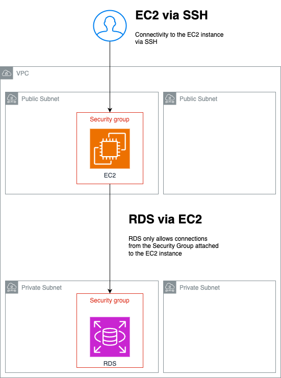

# AWS CDK TypeScript Project: VPC, EC2, and RDS Setup

## Overview

This project is an AWS Cloud Development Kit (CDK) application that provisions 

- a VPC
- an EC2 instance
- RDS PostgreSQL database. 

The infrastructure includes a VPC with public and private subnets across two Availability Zones

- an EC2 instance within a public subnet
- an RDS instance within a private subnet.

After deployment, the CDK will output the relevant information such as EC2 public IP, RDS endpoint, etc.

## Resources Created

- **Amazon VPC**: A virtual private cloud with public and private subnets.
- **EC2 Instance**: An Amazon EC2 instance within the public subnet.
- **RDS Instance**: An Amazon RDS PostgreSQL instance within a private subnet.
- **Security Groups**: Separate security groups for EC2 and RDS instances with minimal access rules.

## Useful commands

* `npm run build`   compile typescript to js
* `npm run watch`   watch for changes and compile
* `npm run test`    perform the jest unit tests
* `npx cdk deploy`  deploy this stack to your default AWS account/region
* `npx cdk diff`    compare deployed stack with current state
* `npx cdk synth`   emits the synthesized CloudFormation template
